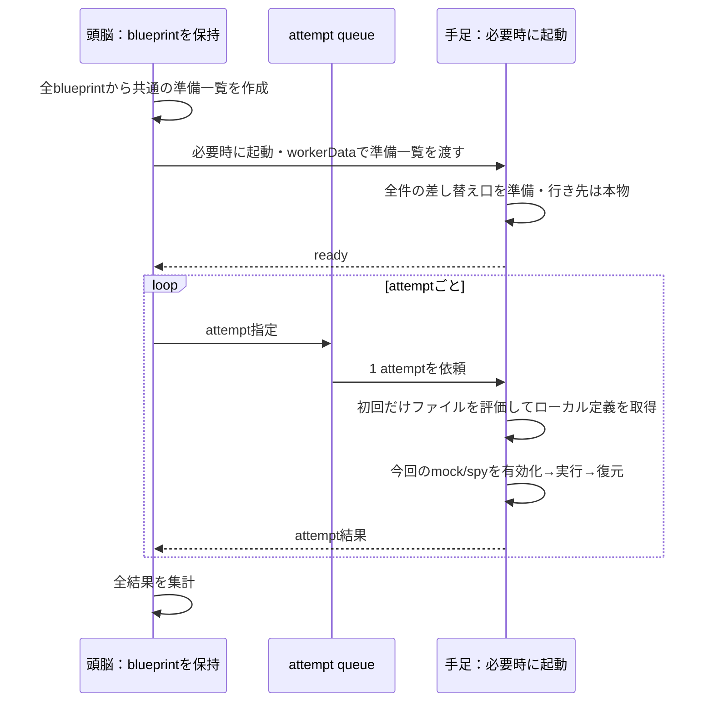

# module mock と attempt queue の PoC

> 2026-09-24の実験記録。当時の実験worktreeにあった `README.md` と `global-setup.md` を一つにまとめたものです。
> runnerスクリプト（`*.mjs`）と生ログ（`results-*.json`）は保存していません。
> 本文中の作業ディレクトリ・隣接worktree・再現コマンドは現在のリポジトリでは成立せず、当時の条件の記録として残しています。

現行版は全blueprintからmock/spy対象を集め、各workerの初期セットアップで全件を準備する。[全件準備の実装前契約と検証結果](#全件準備へ進めるための契約)も参照。

## 実装前の契約

目的: 頭脳が収集した blueprint から関数を含まない attempt 指示を作り、別 worker が静的 import の依存を読み込み前に準備し、再評価した定義で試行できるか確認する。

事前条件:
- 対象は ESM の名前付き関数 export。対象 module URL は PoC 内で明示する。
- 定義は再評価可能。各 worker 内の試行は直列に実行する。
- Node は公式 `node:test` の module mock、Bun は `bun:test` の module mock を使用する。
- 公開 API 案を確定しない。PoC の slot は既存の `Test.mock` / `run` を接続する内部実験用。

事後条件:
- 頭脳で `.blueprint()` を読んでも対象関数・fake は呼ばれない。
- 指示を structured clone でき、関数・オブジェクトの生参照を worker 間で渡さない。
- 手足は指定 module/export の dispatch 関数をテストファイル import 前に用意する。
- 準備対象は全blueprintから収集し、attemptの適用対象とは分ける。最初がmockなしでも、後続ファイルのmock/spyが効く。
- 通常の `target(calc)` と in-source の `target(calc)` の両方で、直接 import した `getData` が mock へ到達する。
- fake は手足で評価したクロージャを使う。親の共通 mock、case の上書き、sequence、呼び出し検証を既存 runner で確かめる。
- 成功、期待した例外、検証失敗の後も slot を元に戻し、次の試行で sequence / 呼び出し記録を持ち越さない。
- 同じ worker の再利用と別 worker 間の隔離を確かめる。

不変条件:
- `src/` と既存テストを変更しない。ユーザーの対象ソースを変換しない。
- collection 側に module mock を登録しない。
- 予期しない実行・検証エラーは失敗として露出させる。

別途の検証:
- native module mock 自体の解除で既存 import と新規 import がどうなるか。
- `import()` の Promise / module namespace から標準的に module URL を取得できるか。

対象外: module mock の公開 API、任意 export（class / mutable value / default / CJS）、group 資源の worker 配置、timeout による強制終了、既にロード済みの依存を後から追加する汎用キャッシュ管理。

## 結果

Linux上のNode 22.18.0 / 24.14.0、Bun 1.3.5で各48 attemptの期待結果を確認した。うち4件は意図的なassertion失敗で、その失敗の報告と直後の復元を検証している。src変更、ユーザーソース変換、fake関数の転送は行っていない。

| 検証 | 結果 |
| --- | --- |
| 頭脳の収集 | 実際のTest.blueprint()を使用。対象関数・fake呼び出しなし。指示をstructuredClone可能 |
| 共通の準備 | 3ファイル・8 blueprintから2 module / 4 exportを重複排除。workerDataで一度渡し、ready時点で全件準備済み、テスト定義・対象関数・fakeは未実行 |
| 直接import / in-source | 両方でtarget(calc)のままmock到達 |
| fake | 手足で再評価したクロージャ、親mockとcase上書き、sequence、呼び出し検証が動作 |
| 復元 | 成功・期待した例外・assertion失敗後の本物の挙動、mockなし→あり→なしの順序を確認 |
| spy | mock設定なしのexpectCalls対象も準備。本物の戻り値とcalledOnceWithを2試行で確認 |
| 再利用・隔離 | 通常順24 attempt、別workerで逆順24 attempt。再利用時はモジュールキャッシュを使用。各workerの状態は独立し、頭脳の状態は変更なし |
| 準備漏れ | 第3のworkerへ未準備exportを要求し、存在しないテストファイルのimportより前にエラーになることを確認 |
| Nodeの実験フラグ | workerのexecArgvに指定可能。頭脳の起動コマンドへ手動追加不要。ただし実験的APIへの依存は残る |

### queueへ載せる準備情報の粒度

`late-preparation-probe.mjs`では、旧方式の検証用workerを使い、準備せずmockなしのケースを実行し、その後でmockを登録した。Node 24.14.0では後続ケースが失敗し、Bun 1.3.5では成功した。現行`verify.mjs`は全体を収集してから共通の準備一覧を作り、各workerで全件を準備する。

- `workerData.preparation`: 全blueprintのmock/spy対象の和集合。各workerへ起動時に一度だけ渡す。jobには含めない。
- `job.moduleMocks`: 今回のattemptがmock/spyするmodule/export。初期準備に含まれることと、手足で得た定義との対応を検証する。名前はPoC内のもの。
- `file / exportName / caseIndex / caseName / attempt / id`: 実行対象と結果の対応。fake自体は含まない。

`external.mjs`は、後で`later.mjs`が使う`later-targets.mjs`も先に読み込む。`later-targets.mjs`は同じdata moduleの別exportと、別のextra-data moduleを直接importする。初期準備を全件にしたことで、後から割り当てられたケースのmockとspyも届く。mock対象module同士が依存し合う場合は今回の検証に含めていない。



既存runへ1ケースに絞って渡しているので、各run内のattempt番号は1。queueのattempt番号は外側で管理する。頭脳はjob ID・attempt番号・statusを集約し、44 passed / 4 intentional failuresを検証する。本体runnerの分散実行やreporterへは未接続。同一性の確認は指定ケース名とmock/spy対象の対応で行い、関数の意味や定義全体の同値性を自動証明するものではない。groupの再帰収集・資源管理は対象外。

### native mockの解除

本物のgetData(3)は4、calc(3)は8。fakeのgetDataは50、calcは100。

| 実行環境 | 解除前calc | 解除後の既存calc | 解除後の新規importのgetData |
| --- | --- | --- | --- |
| Node 24.14.0: context.restore() | 100 | 100 | 4 |
| Bun 1.3.5: mock.restore() | 100 | 100 | 50 |

そのため、attemptごとにnative mock登録を解除する方式にはしていない。workerが保持するdispatch関数の行き先を、既存Test.mock/runが一時的に差し替えて戻す。worker終了でその環境を破棄する。関数identityやモジュール内部の任意の可変状態まで元に戻す保証は含まない。

### import()の識別子

両環境でimport Promiseのown keysは空、namespaceのown keysはexport名とSymbol.toStringTagだった。この観測からURLを得る方法は見つかっていない。あらゆる識別手段の不可能性を証明したわけではない。

初回のprobeはnamespaceのprototypeをnullと仮定してBunで失敗した。URL取得には不要な仮定だったため、prototypeは観測値に変更した。Nodeはnull、Bunは非null。ランタイム内部の形に依存する推測で識別しない方針とする。

未解決: `mockModule(import('./data'), ...)`等の自然な公開APIからmodule識別子を取得する方法。PoCでは明示URLと内部slotを使っており、利用者向けの書き味を実現済みとはしていない。

### worker起動時間

今回の各2サンプルはNode 22が約135/98ms、Node 24が約64/49ms、Bunが約40/39ms。workerのready通知までで、今回から全件のmock準備も含む。テストファイルの評価は含まない。前回とは測定区間が異なり、負荷を制御したベンチマークでもないため、この値だけで配置方式や性能差は判断しない。

## 再現コマンド

worktreeのルートで実行する。以下の最終検証はすべてexit 0。late-preparationはNode側のテスト失敗を期待結果としてassertしている。

```sh
timeout 45s node experiments/module-mock-queue/verify.mjs
timeout 45s volta run --node 22.18.0 node experiments/module-mock-queue/verify.mjs
timeout 45s bun experiments/module-mock-queue/verify.mjs
node --experimental-test-module-mocks experiments/module-mock-queue/restore-probe.mjs
bun experiments/module-mock-queue/restore-probe.mjs
node experiments/module-mock-queue/specifier-probe.mjs
bun experiments/module-mock-queue/specifier-probe.mjs
timeout 20s node experiments/module-mock-queue/late-preparation-probe.mjs
timeout 20s bun experiments/module-mock-queue/late-preparation-probe.mjs
```

未検証: 他OS・ブラウザ・Deno、class/default/CJS/mutable export、循環import・複数の相互依存mock、groupの再帰収集と資源管理、timeout強制終了、実用負荷でのworker配置。依存moduleを準備のために読むこと自体が別の対象を先にロードする可能性は残る。任意の書き方で動くことを証明したPoCではない。既存の本体テストスイートは変更しておらず、今回は再実行していない。

公式APIの参照: [Node 24 mock.module](https://nodejs.org/download/release/v24.14.0/docs/api/test.html#mockmodulespecifier-options)、[Bun module mocks](https://bun.com/docs/test/mocks)。

## 全件準備へ進めるための契約

目的: 頭脳がblueprint全体から作った共通の準備一覧を各workerへ一度渡し、jobの割り当て順序とmock/spy対象の準備を切り離す。

事前条件:
- 今回も既存PoC内で検証する。module URLを明示する内部slotと既存Test/runを使う。
- 定義は再評価可能。対象はESMの名前付き関数。worker内のattemptは直列。
- 「全件」は、頭脳が収集した全テストのmock対象と、expectCallsだけで指定したspy対象の和集合。
- 準備する依存module同士は、この検証では相互依存しない。循環import等の一般化は含めない。

事後条件:
- 頭脳は全ファイルのblueprintを収集してから、module URL / export名を重複排除した共通の準備一覧を作る。
- 各workerは同じ一覧を初期セットアップで受け取り、全件を準備してからreadyを返す。ready時点ではテスト定義もfakeも実行しない。
- attempt jobに準備一覧は載せない。ファイル・export・ケース・試行番号・照合情報を渡す。関数は転送しない。
- 最初のファイルが別ファイルのテスト対象依存も先にimportする場合でも、後から受けたjobでmockが効く。
- 同一moduleの別exportが別ファイルでmockされる場合も、全exportを初期セットアップで準備する。
- spyだけの対象も準備し、試行中は本物を呼んで呼び出しを記録する。続く試行に記録を持ち越さない。
- 成功・期待例外・意図的失敗の後に復元する。通常順・逆順でファイルを実行し、再利用とworker間隔離を確認する。
- 実行結果をjob IDに対応づけて頭脳で集計する。意図的失敗も失敗として報告される。

不変条件:
- 頭脳のblueprintは実行計画の出所とする。手足による再評価は指定ケースのローカル関数を得るために行う。
- collection側はmockを適用せず、target/fakeも呼ばない。
- 準備時のdispatchは本物へ通す。fakeやspy記録はattemptの間だけ有効。
- src/と既存テストは変更しない。ユーザーソースの変換、commit、pushを行わない。

境界の検証:
- global一覧を空にしてmockなしのケースから開始する旧方式のprobeを残し、Nodeの後付けmock失敗を引き続き観測する。
- 全体収集に含まれないmodule/exportをjobで要求した場合、テストファイルを読む前にエラーにする。

### 検証結果

Node 22.18.0 / 24.14.0、Bun 1.3.5のすべてで、以下の観測と契約を確認した。

| 条件 | 検証 |
| --- | --- |
| 全体収集 | 3ファイルの8 blueprintを保持し、2 module / 4 exportを重複排除。spyだけのgetObservedも含む |
| 初期セットアップ | workerData.preparationを各workerへ一度転送。readyの時点で一覧が一致し、定義評価数・fake・本物の関数呼び出しはすべて0 |
| job転送 | 準備一覧をjobから除去。準備情報とjobをstructuredCloneできることを確認 |
| 後続ファイル | externalがlater-targetsを先にimportし、後続のlaterが別exportと別moduleをmockして期待値を返す |
| spy | expectCallsだけのケースが本物の値を返し、2 attemptともcalledOnceWithが成立 |
| 復元・再利用 | 各ファイルでmockなし→各ケース→mockなし。失敗・例外後にも全targetの本来の戻り値を検証 |
| 順序・隔離 | 1 workerで通常順24 attempt、別workerで逆順24 attempt。定義の評価回数とfake呼び出し数を追跡し、頭脳は変更なし |
| reporting | 48個の一意なjob IDで結果を集約。44 passed、意図的失敗4件 |
| 準備漏れ | 未準備exportのjobを第3workerで拒否。存在しないテストファイルを読む前に準備漏れのエラーになる |

再現コマンド（worktreeルートで実行、すべてexit 0）:

```sh
timeout 45s node experiments/module-mock-queue/verify.mjs
timeout 45s volta run --node 22.18.0 node experiments/module-mock-queue/verify.mjs
timeout 45s bun experiments/module-mock-queue/verify.mjs
```

既存のlate-preparation / restore / specifier probeもNode 24とBunで再実行し、前回と同じ観測を確認した。コマンドと意味は[本書の「再現コマンド」](#再現コマンド)に記録。

### 目的との対応

今回の目的「全件を準備してから、割り当てられたattemptを実行する」は上記の範囲で達成した。全体の準備をworkerDataへ、個々の実行指示をqueueへ分け、関数転送やユーザーソース変換なしで直接importにmock/spyを届けている。

上位目的の「違和感なく、どこでも使える」はまだ部分的。公開APIのmodule識別子取得、本体runnerへの接続、groupの再帰収集、相互依存moduleの準備順、他の実行環境は未検証。全件準備はこれらを自動的に解決するものではない。今回の結果を根拠に、任意のコードで成立すると保証しない。
