# テスト実行の概念マップ

テストを書く人が「指定したテストを実行し、期待どおりだったかを知る」ために、何を扱い、どんな仕事が必要になるかを示す。

青い箱は扱う概念・データ、黄色い箱は仕事・責務、赤い箱は受け付けられない条件を表す。主となる線は、入力から仕事を経て成果へ進む流れとして読む。

一枚に一つの仕事を置き、その仕事の中身を次の階層の図で開く。全体の意味を知りたいときはP0、個別の仕事を知りたいときはその詳細へ進む。

## 概念の意味と関係

| 概念 | 意味 | 関係 |
| --- | --- | --- |
| テスト定義 | 何を対象に、どの入力で、何を期待するかという約束 | グループ、対象ケース群、ケース、共通条件を含む |
| グループ | 共通条件を適用するテストのまとまり | 対象ケース群や別のグループを含む |
| 対象ケース群 | 一つの実行対象を検証するケースのまとまり | 実行対象と複数のケースを持つ |
| ケース | 一つの入力と期待を持つ検証の単位 | 実行すると一回以上の試行を持つ |
| 期待 | 戻り値・例外・呼び出しについて望む振る舞い | 試行で得られた実際の振る舞いと照合する |
| 実行条件 | 今回の対象の絞り込みや、成否の判断に使う指定 | 定義と合わせて計画を決め、結果の判断にも使う |
| 実行計画 | 今回扱うテストと、適用する条件・必要なリソースを確定したもの | テスト定義と実行条件から作り、実行の入力になる |
| 試行 | ケースを一度実行し、期待と照合すること | 再試行するたびに新しい試行結果を生む |
| リソース | テストのために用意し、利用後に解放するもの | ケースやグループが要求し、別のリソースを必要とする場合がある |
| ケースの結果 | 試行履歴、または実行しなかった理由 | 実行全体の結果を判断する材料になる |
| 実行全体の結果 | テスト全体の成否、終了理由、個別の結果 | ケース、グループ、リソースの結果をまとめる |

定義は「何を確かめるか」、計画は「今回どう扱うか」、結果は「何が起きたか」を表す。ケースと、それを一度実行する試行も別の概念として扱う。

## 図の階層

| 図 | 仕事 | 入力 | 成果 |
| --- | --- | --- | --- |
| [P0](#p0-テストを実行する) | テストを実行する | テストファイル、実行条件 | 実行全体の結果 |
| [P1](#p1-定義を収集する) | 定義を収集する | テストファイル | テスト定義と出典 |
| [P2](#p2-実行計画を作る) | 実行計画を作る | テスト定義、実行条件 | 実行計画 |
| [P2.1](#p21-実行構造を組み立てる) | 実行構造を組み立てる | テスト定義 | 共通条件を反映したテストの階層 |
| [P2.2](#p22-実行対象を選ぶ) | 実行対象を選ぶ | テストの階層、実行条件 | 今回扱うケースと実行・未実行の指定 |
| [P2.3](#p23-必要なリソースを計画する) | 必要なリソースを計画する | 実行するケースとリソースの要求 | 必要なリソースと準備の順序 |
| [P3](#p3-計画を実行する) | 計画を実行する | 実行計画、実行条件 | 後処理を含む実行全体の結果 |
| [P3.1](#p31-グループを実行する) | グループを実行する | グループと適用条件 | 子の結果と共通の前処理・後処理の結果 |
| [P3.2](#p32-ケースを実行する) | ケースを実行する | ケースと適用条件 | 試行履歴または未実行理由 |
| [P3.3](#p33-ケースを一度試行・検証する) | ケースを一度試行・検証する | 実行対象、入力、期待、適用条件 | 試行結果 |
| [P3.4](#p34-リソースを準備・解放する) | リソースを準備・解放する | リソースの要求と準備の順序 | 利用する値と準備・解放の結果 |

## P0: テストを実行する

**仕事**: テストの約束を受け取り、今回の対象を決め、実行して、期待どおりだったかを判断する。

**入力**: テストファイル、実行条件。完成したテスト定義を直接受け取る場合は、定義から始める。

**成果**: 実行全体の結果。

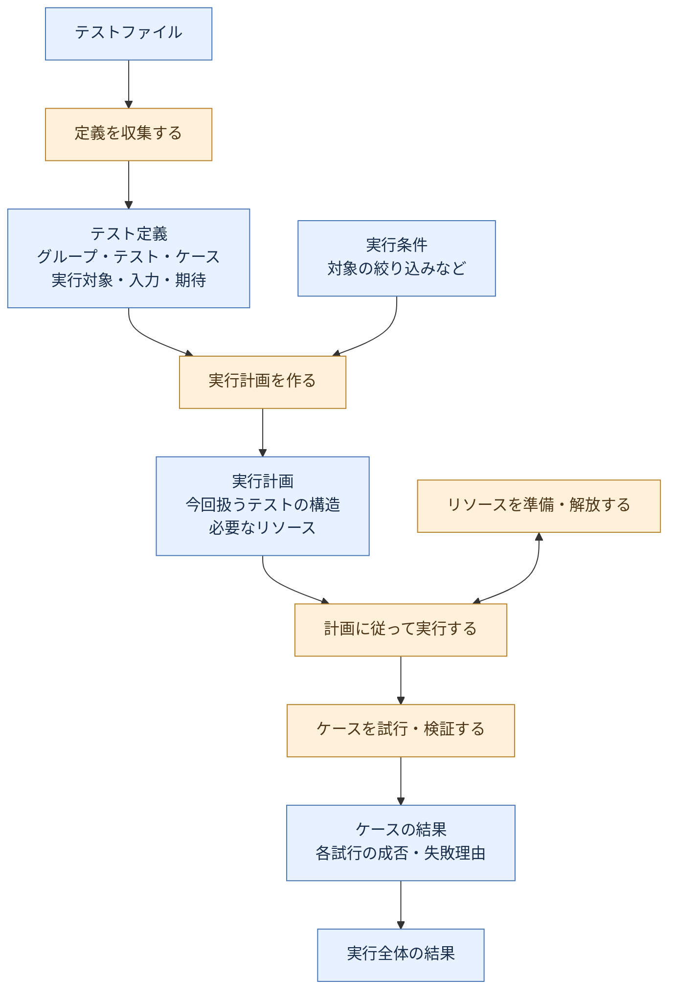

主経路は、テストファイルから定義、計画、ケースの結果、実行全体の結果へ進む。リソースとの往復は、必要なものを用意して利用し、利用後に解放する関係を表す。

「定義を収集する」をP1、「実行計画を作る」をP2、「計画に従って実行する」をP3で開く。ケースの試行・検証と結果の取りまとめは、P3の中の仕事でもある。

## P1: 定義を収集する

**仕事**: テストファイルから、実行する約束として受け取れる定義を集める。

**入力**: テストファイル。

**成果**: テスト定義と、その定義が書かれた場所。

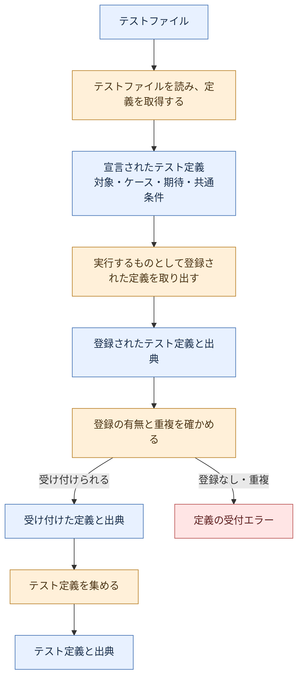

定義を「書いたこと」と「実行するものとして登録したこと」を区別する。出典は、後で結果や問題を元の定義に結びつけるために残す。

## P2: 実行計画を作る

**仕事**: テスト定義と実行条件から、今回扱うテストと、その実行に必要なものを確定する。

**入力**: テスト定義、実行条件。

**成果**: 実行計画。

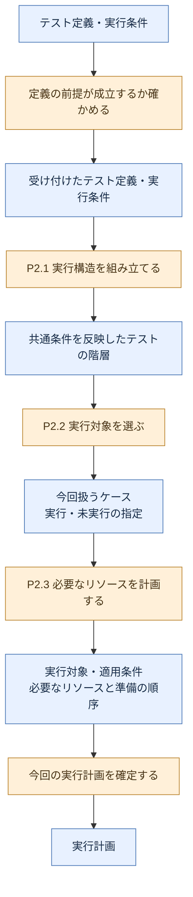

対象の絞り込み、集中実行の扱い、必要なリソースはここで決める。計画を作る仕事の成果は「今回の実行の約束」であり、試行結果は実行後に得られる。

### P2.1: 実行構造を組み立てる

**入力**: テスト定義。

**成果**: 共通条件を反映したテストの階層。

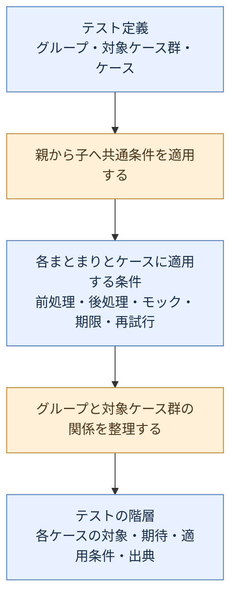

グループは共通条件の適用範囲を表す。対象ケース群は同じ実行対象を検証するケースをまとめる。この二つのまとまりを区別して、各ケースがどんな条件で実行されるかを明らかにする。

### P2.2: 実行対象を選ぶ

**入力**: テストの階層、実行条件。

**成果**: 今回扱うケースと、実行するもの・実行しないものの指定。

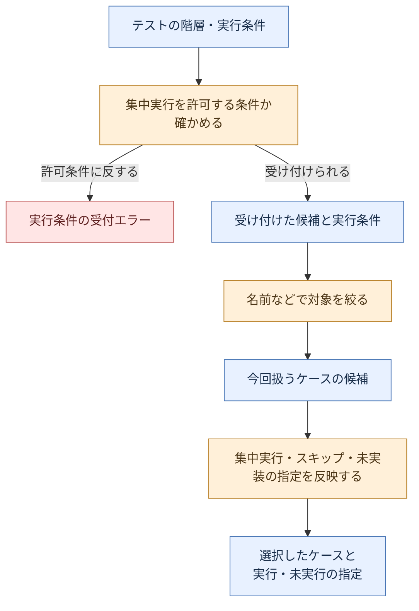

今回の対象から外すことと、今回の対象に含めたうえで実行しないことは、結果に残す意味が異なる。後者は、スキップ・未実装などの理由を結果に残す。

### P2.3: 必要なリソースを計画する

**入力**: 実行するケースと、そのケースが要求するリソース。

**成果**: 必要なリソースと、準備する順序。

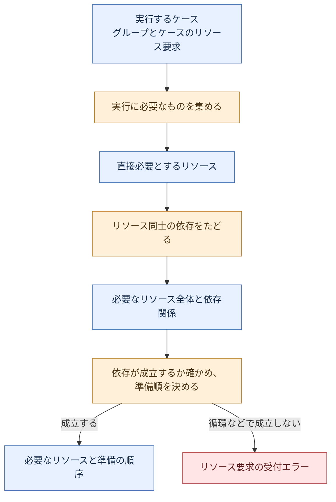

あるリソースを準備するために別のリソースが必要なら、その依存先も含める。共有する範囲と期間も、リソースの約束として扱う。

## P3: 計画を実行する

**仕事**: 計画に沿ってテストを実行し、必要な後処理を終えて、全体の結果を得る。

**入力**: 実行計画、実行条件。

**成果**: 後処理を含む実行全体の結果。

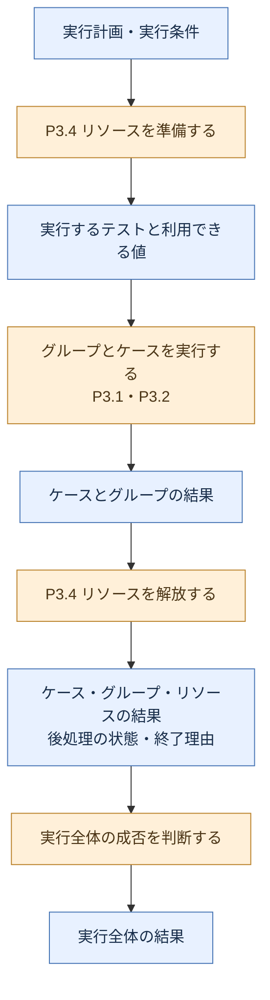

試行が成功したか、必要な後処理が終わったか、途中で中断したかを合わせて結果を判断する。進捗は「途中までに何が起きたか」、最終結果は「全体がどう終わったか」を表す。

### P3.1: グループを実行する

**入力**: グループと、そのグループに適用する条件。

**成果**: 子の結果と、共通の前処理・後処理の結果。

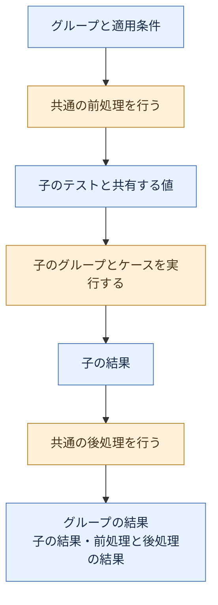

グループ全体を囲む前処理・後処理は、そのまとまりについて一度行う。共通の前処理が成立せず開始できなかった子も、未実行の理由を持つ。

### P3.2: ケースを実行する

**入力**: ケースと、そのケースに適用する条件。

**成果**: 試行履歴、または実行しなかった理由。

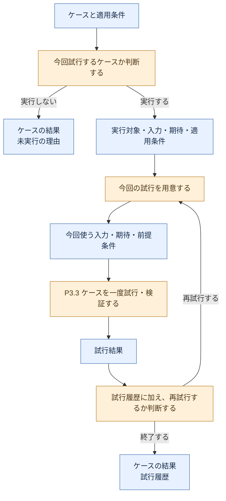

一つのケースに複数の試行が生じることがある。再試行後に成功しても、途中の失敗は試行履歴に残す。再試行の許可と上限、続けられる前提が成立するかによって次の試行を決める。

### P3.3: ケースを一度試行・検証する

**入力**: 実行対象、入力、期待、適用条件。

**成果**: 観測した振る舞い、検証の判定、前処理・後処理の状態を持つ試行結果。

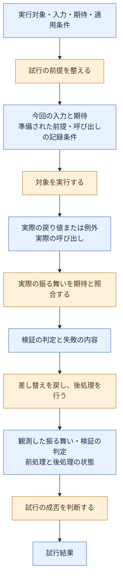

例外を投げること自体を期待しているケースもある。戻り値・例外・呼び出しを観測し、そのケースの期待と照合して判定する。前提を整えられなかった場合や、後処理が完了しなかった場合も、試行の結果に含める。

### P3.4: リソースを準備・解放する

**入力**: 必要なリソースと準備の順序。

**成果**: 利用する値と、準備・解放の結果。

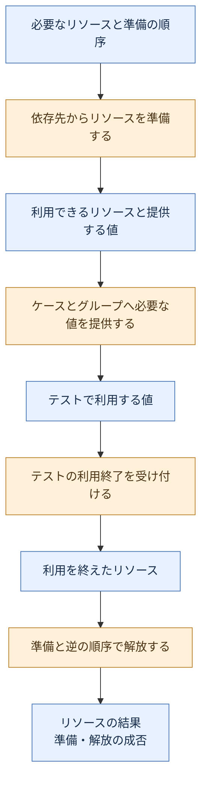

リソースの要求は「何が必要か」、提供値は「準備した結果、テストに何を渡せるか」を表す。準備できなかった場合は、そのリソースを必要とするテストを始められない。解放の成否も、テスト全体がどう終わったかを判断する材料になる。

## このマップで確かめること

- 各概念が何を意味し、どの概念と関係するか。
- 各仕事が何を受け取り、何を成果として生むか。
- 親の仕事を開いたとき、同じ入力から同じ成果へ辿れるか。
- 定義・計画・試行・結果が、それぞれ別の意味で扱われているか。
- 失敗、未実行、再試行、中断、後処理を、テストの意味として説明できるか。
